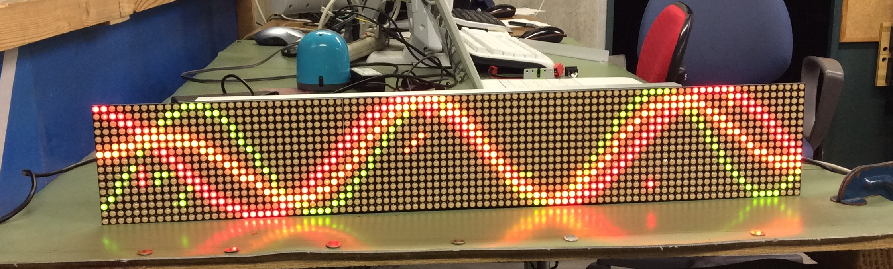

# MatrixLED Project
## 概要

* 16x96 2色マトリクスLEDパネルを用いてGithubの共同開発をするためのリポジトリです。
* マイコンは [PSoC 5LP Prototyping kit](http://akizukidenshi.com/catalog/g/gM-09432/) (CY8C5888LTI-LP097) を用いています。

## git clone
    git clone https://github.com/RobotClubKut/MatrixLED

## Project
### TEST0
* ピン配置のみ指定したプロジェクト

### DotMatrixPattern
* Sin Wave を表示
* ボールの跳ね返り運動を表示
